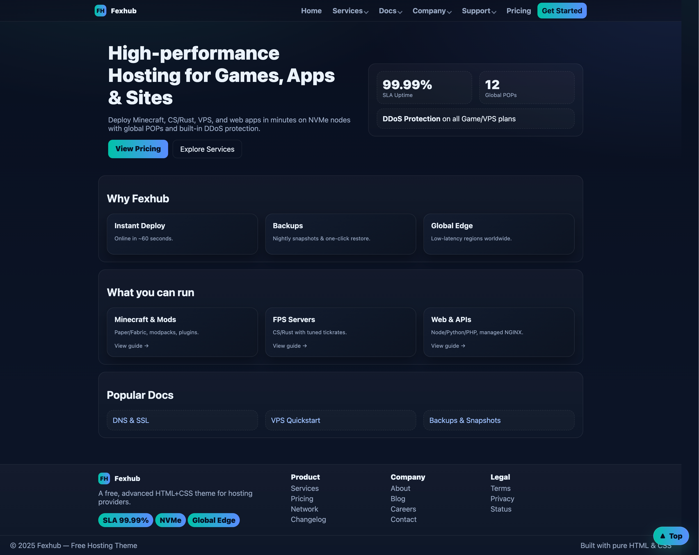
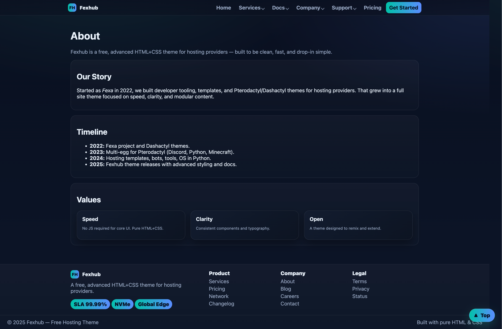
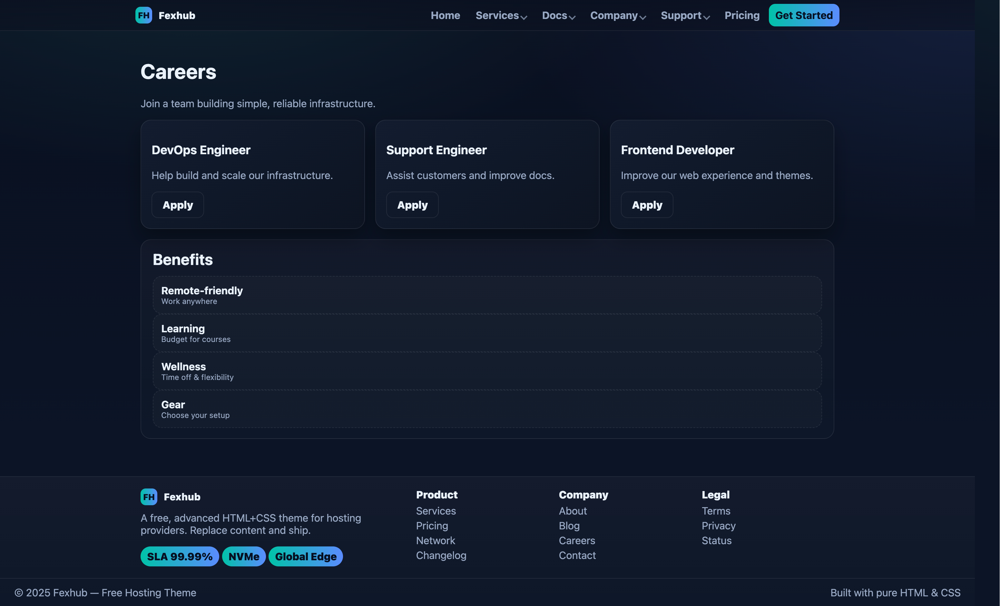

# 🌐 Fexhub Nova — Free Hosting Theme (HTML + CSS)

Fexhub Nova is a **multi-page, responsive hosting website template** built in pure **HTML + CSS**.  
It’s designed for **hosting providers**, **game server communities**, and **developers** who want a **modern, professional website** without the complexity of frameworks or build tools.

---

## ✨ Features

- **Multi-page layout** out of the box:
  - `index.html` — Home
  - `services.html` — Game Hosting, VPS, Web Hosting, Add-ons
  - `pricing.html` — VPS, Game Hosting, Web Hosting plans
  - `docs/` — Ready-made documentation pages (Minecraft, FPS, VPS, Web, DNS, Billing, Backups, Troubleshooting)
  - `faq.html` — Frequently Asked Questions
  - `status.html` — Live service health, regions, uptime history
  - `about.html` / `careers.html` / `blog.html` / `case-studies.html` / `contact.html`
  - `terms.html` / `privacy.html`
- **Advanced header** with dropdowns + mega menu
- **Sticky footer** with CTA, columns, social icons
- **SEO-ready** with meta tags + JSON-LD structured data
- **Mobile responsive** (flexible grid system, mobile nav)
- **Docs pack** for SEO-friendly knowledge base
- **No JavaScript required** (everything works with HTML + CSS)

---

## 📂 Structure

```
fexhub-nova/
├── index.html
├── about.html
├── services.html
├── pricing.html
├── faq.html
├── status.html
├── blog.html
├── case-studies.html
├── contact.html
├── careers.html
├── changelog.html
├── terms.html
├── privacy.html
│
├── docs/
│   ├── docs.html
│   ├── docs-minecraft.html
│   ├── docs-fps.html
│   ├── docs-vps.html
│   ├── docs-web.html
│   ├── docs-dns.html
│   ├── docs-billing.html
│   ├── docs-backups.html
│   └── docs-troubleshooting.html
│
└── assets/
    ├── css/
    │   └── style.css
    ├── img/
    └── fonts/
```

---

## 🚀 Getting Started

1. **Clone or download**
   ```bash
   git clone https://github.com/yourusername/fexhub-nova.git
   ```
2. Open `index.html` in your browser.  
   No build step, no Node.js — just plain HTML/CSS.
3. Edit content:
   - Update text in `*.html` files
   - Change colors in `assets/css/style.css` (`--accent`, `--accent2`, etc.)
   - Replace demo logos/images in `assets/img/`
4. Deploy to any static host:
   - [Netlify](https://netlify.com)
   - [Vercel](https://vercel.com)
   - [GitHub Pages](https://pages.github.com)
   - or your cPanel/Apache/Nginx server.

---

## 📖 Documentation

- **Docs pack** included: Minecraft, VPS, Web Hosting, DNS & SSL, Billing, Backups, Troubleshooting.  
- **SEO-friendly FAQ** with JSON-LD so your Q&A can show up directly in Google results.  
- **Pricing page** includes schema.org `OfferCatalog` structured data for rich snippets.

---

## 🖼️ Screenshots

|  |  |  |  |

---

## 🤝 Contributing

Pull requests are welcome!  
If you want to add new pages, themes, or accessibility improvements:
1. Fork the repo
2. Create a new branch (`git checkout -b feature/amazing-feature`)
3. Commit your changes
4. Push and open a PR

---

## 📜 License

Released under the **MIT License**.  
Free to use, modify, and redistribute. Attribution is appreciated.

---

## 🙌 Credits

Built with ❤️ as a **free, open theme for hosting providers**.  
Maintained by the [Fexhub](https://github.com/Fex-Development) project.
